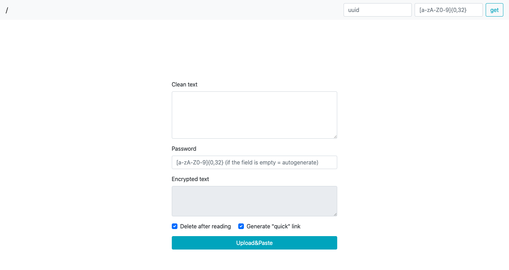

# Crypt (old)

### Pic:

---

## todo:

1. [x] beta-версия
2. [x] Рефакторинг
3. [x] Оптимизация
4. [x] Найти другую либу (или способ) для шифрования на стороне клиента, так как текущая очень слабая в плане криптостойкости
5. [x] Закончить реализацию исходной идеи - шифрование/расшифровка полностью на стороне клиента (даже открытый текст на сервер не отправляется), без надобности хранения пароля в БД *(see example: `db.json`)*. Ваши заметки не сможет прочитать даже владелец сервиса.
6. Копирование "quick link" в буфер обмена.
7. Продолжить идею логгирования (logging warnings - bad UUIDs, malcode in client query)
8. Добавить хранение файлов (картинки, архивы, документы)

