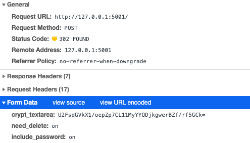

## Info

- Пароль и открытый текст никогда не отправляется и не хранится в DB.
- Encrypt/decrypt полностью на client-side за счет CryptoJS (AES-256). 
  - Шифрование происходит в Вашем браузере, а не на стороне приложения (как у 99% аналогичных сервисов) после отправки. Иными словами, даже администратор сервиса не может получить доступ к Вашему [открытому тексту](https://ru.wikipedia.org/wiki/Открытый_текст). 
- В случае, если Вы или кто-то другой, введет неправильный пароль с включенной функцией “Delete after reading”, то заметка так же будет удалена.
- ***Если Вы не используете автоматическую генерацию***, пожалуйста, соблюдайте следующие требования к паролю - `[a-zA-Z0-9]{12,64}`. Надеюсь, что Вам поможет данный [snippet](https://gist.github.com/delyee/3784638497a97ab5938e0248dc20e1f1).

## Функции

### Заметки:

*(всё нижеследующее - опционально)*

- Удаление заметки после прочтения
- Генерация пароля за пользователя, устойчивого к прямому перебору 
- Генерация “quick link” - позволяет получить ссылку, включающую в себя UUID+%password% для удобства пользователя: Вы можете передать её по незащищенным каналам связи, если получатель по умолчанию сразу прочитает записку после публикации (обязательно с включенной опцией "удалить после прочтения" и генерацией пароля)

## Pics

---

## todo:

0. ~~beta-версия~~
1. ~~Рефакторинг~~
2. ~~Оптимизация~~
3. ~~Найти другую либу~~ для шифрования на стороне клиента, так как текущая очень слабая в плане криптостойкости
4. ~~Закончить реализацию~~ исходной идеи - шифрование/расшифровка полностью на стороне клиента (даже открытый текст на сервер не отправляется), без надобности хранения пароля в БД *(see example: `db.json`)*. Ваши заметки не сможет прочитать даже владелец сервиса.
5. Продолжить идею логгирования (logging warnings - bad UUIDs, malcode in client query)
6. Автоматическое копирование "quick link" в буфер обмена
7. Добавить хранение файлов (картинки, архивы, документы)